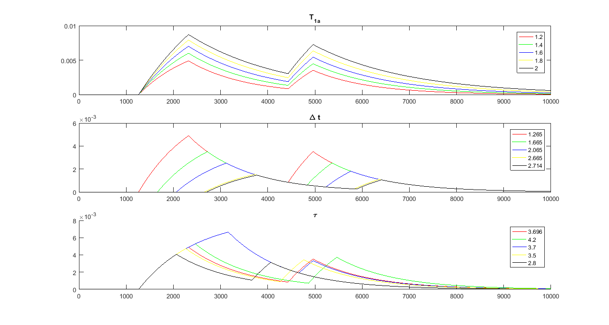

# Hadamard_te_asl_signal
Hadamard time encoded arterial spin labeling signal
# If this repository helps you in anyway, show your love :heart: by putting a :star: on this project 

# Citation
    @inproceedings{yousefi2019fast,
      title={Fast Dynamic Perfusion and Angiography Reconstruction Using an End-to-End 3D Convolutional Neural Network},
      author={Yousefi, Sahar and Hirschler, Lydiane and van der Plas, Merlijn and Elmahdy, Mohamed S and Sokooti, Hessam and Van Osch, Matthias and Staring, Marius},
      booktitle={International Workshop on Machine Learning for Medical Image Reconstruction},
      pages={25--35},
      year={2019},
      organization={Springer}
    }

    
    <em>Hadamard time-encoded arterial spin labeling signal plots for different parameter values for one of the sub-boluses.</em>

